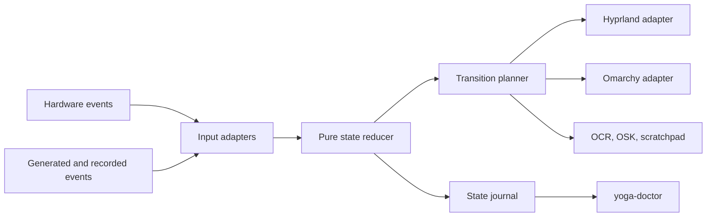

# Tested Convertible Architecture

## Objective

Build a reliable convertible and stylus stack whose behavior is observable, reproducible, and testable. Display, touch, pen, posture, suspend/resume, external monitors, and failure recovery must behave as one coordinated system.

## Runtime model

The reducer accepts typed events and returns new state plus desired effects. It performs no I/O. One coordinator discovers devices, debounces sensor changes, sequences transitions, serializes compositor effects, and reconciles observed state at startup, resume, hotplug, and compositor reconnection.

Representative events include tablet-switch changes, orientation changes, hinge angles, orientation-lock changes, monitor-topology changes, pen proximity/buttons, resume, compositor reconnect, and shutdown.

Representative effects include internal-input enablement, coordinated display/input transform, state publication, notifications, OSK control, OCR selection, and scratchpad launch.

## Posture and rotation

Use `SW_TABLET_MODE` as the authoritative binary safety signal. It does not distinguish tablet, tent, and stand. Rich posture labels require a recorded and tested classifier using hinge angle, lid/base accelerometers, and hysteresis.

An accepted rotation is a serialized transaction affecting:

1. the internal display transform;
2. touchscreen transform and mapping;
3. pen/tablet transform and mapping.

The adapter changes only owned properties and preserves scale, position, mode, color, VRR, and external-monitor topology. Orientation lock blocks transform changes but not posture-based input inhibition.

Only discovered internal keyboard, touchpad, and TrackPoint devices may be disabled. External devices are never targets. Startup, shutdown, failure, and recovery flows must converge to a safe, recoverable state.

The concrete ownership, ordering, mutation, and recovery contract is documented in
[`input-inhibition.md`](input-inhibition.md).
The exact display/touch/pen ownership and partial-mutation contract is documented in
[`rotation.md`](rotation.md).
The orientation normalization, claim lifecycle, and reconnect contract is documented in
[`orientation-sensor.md`](orientation-sensor.md).

The Omarchy Shell plugin is an unprivileged presentation and control client. It communicates
with the running user service through a mode-0600 Unix socket below `XDG_RUNTIME_DIR`; it never
reads evdev or calls Hyprland itself. Status is derived only from reducer-owned state. Lock,
manual rotation, and emergency recovery commands re-enter the runtime's serialized reducer
owner before producing effects. A missing runtime is reported as unavailable without inventing
posture, orientation, or input-safety state. If `XDG_RUNTIME_DIR` is unavailable, the transport
fails closed; it never falls back to a shared path below `/tmp`.

The plugin is also the settings client for the posture the settings are for. `get_config`
returns every setting with its value, the file that set it, and enough of its schema for the
panel to choose a control; `set_config` stores one setting, or clears it when no value is sent.
The panel holds no list of settings of its own, so a row added to the runtime's settings table
becomes a control with no QML change. A stored value re-enters the reducer as `SettingsChanged`,
which plans the same `RefreshOskTheme` effect a theme change does, because the keyboard rebuilds
its whole argument vector when it respawns. Values are refused at the transport against the same
table the settings file is read through, so no client can store what the file would discard. See
[`settings.md`](settings.md).

The posture runtime is one asyncio owner of reducer state and input effects. It first
reenables owned inputs, reads the current switch state, and then consumes continuous
`SW_TABLET_MODE` events. Device reconnects and a periodic reconciliation pulse rediscover
evdev and Hyprland state. Cancellation and normal shutdown both plan input recovery through
the reducer. The `yoga-deck-runtime` entry point handles `SIGTERM` (a systemd stop, logout, or
restart) and `SIGINT` by cancelling the runtime once, so the same reducer-planned shutdown
re-enables internal inputs and tears down the OSK in-process before the process exits 0. Further
stop signals during shutdown are reported as `shutdown_in_progress` and cannot skip or repeat that
recovery. Shutdown is bounded at 10 s, well inside systemd's stop timeout; if it overruns, the
runtime reports `shutdown_timed_out` and exits 1 without waiting. The unit's `ExecStopPost`
`yoga-doctor recover-inputs` runs after every stop as an independent backup. A logind resume signal enters the reducer as a fresh-observation request; the runtime
then reopens switch, orientation, and pen sessions before reconciling the current safe state.
In-flight compositor mutations are drained before cancellation releases their ordering locks,
so shutdown recovery cannot be overtaken by an older worker. Periodic reconciliation uses the
same reducer lock as accepted events. Runtime diagnostics contain only stable component and error codes. The precise contract is in
[`suspend-resume.md`](suspend-resume.md).
A source failure is reported once per change of failure code, not once per retry. When the
tablet switch or pen node exists but cannot be opened, the adapters raise a distinct
`InputAccessDenied` error; the runtime reports `device_permission_denied`, retries with a
doubling delay capped at 30 s instead of the short disconnect delay, converges to laptop posture
with internal inputs enabled, and exposes `degraded: "input_access_denied"` in the shell status.
Hyprland adapters resolve the live compositor instance per call rather than trusting the
signature inherited at service start, so periodic reconciliation re-applies reducer intent to a
replacement compositor; the contract and its unvalidated live status are in
[`hyprland-reconnect.md`](hyprland-reconnect.md).

Hyprland monitor add/remove socket events are normalized without their connector or description
payloads. They likewise request fresh observation through the reducer, then reconcile only the
owned internal display/touch/pen transaction. The contract is in
[`monitor-hotplug.md`](monitor-hotplug.md).

## Stylus behavior

Pen proximity, tip, pressure, eraser, and buttons are supported concepts. A distinct chassis silo
event is unverified, so unholster automation remains experimental. Native pen/touch arbitration
has been measured on the initial target: application-visible palm contacts were rejected in 4/4
valid hover trials and 5/5 tip-down trials, while the pen-away control delivered 5/5 touches.
Yoga Deck therefore preserves native arbitration rather than disabling the touchscreen during pen
proximity. See [`results/palm-rejection-2026-08-26.md`](results/palm-rejection-2026-08-26.md).
On the initial pen, proximity and pressure-bearing tip contact are confirmed. The side button
farthest from the tip emits `BTN_STYLUS` and exhibited a 5.3 ms duplicate cycle in one controlled
trace, so normalized barrel-button cycles use a 50 ms debounce while retaining raw diagnostic
counts. The near-tip button initially emitted no usable action events, but a later exploratory run
observed raw `BTN_TOOL_RUBBER` lifecycles and one correlated Qt `PointerDevice.Eraser` delivery.
Its normal-pen control was incomplete, so it must not receive a binding until the controlled
campaign passes. See [`results/pen-actions-2026-08-26.md`](results/pen-actions-2026-08-26.md) and
[`results/near-button-application-2026-08-27.md`](results/near-button-application-2026-08-27.md).
The opposite-end eraser remains unverified and unbound. A synchronized five-
press reliability campaign then observed one raw and one debounced `barrel_primary` cycle in every
trial; this supports considering, but does not install, a future explicitly authorized mapping.
See [`results/far-button-reliability-2026-08-27.md`](results/far-button-reliability-2026-08-27.md).
Use `omarchy capture text` as the initial OCR backend and build a custom pipeline only if measured
limitations justify it. OCR requests enter as monotonically sequenced, already-debounced semantic
pen actions, become a `CaptureText` effect in the pure reducer, and are serialized through a
privacy-safe adapter that never reads source pixels, command output, or recognized text.
The runtime dispatches accepted captures into tracked tasks; the OCR coordinator serializes those
captures independently of compositor effects. Waiting for a region selection never holds the
reducer or compositor lock. Shutdown cancels active and queued captures and reaps the owned
process group after recovering inputs. The
contract and guided measurement protocol are documented in [`ocr-capture.md`](ocr-capture.md).
The optional scratchpad uses the same pure sequenced-action pattern and launches an existing
application without choosing or inspecting a document; see [`scratchpad.md`](scratchpad.md).

The on-screen keyboard uses a pure `SetOskEnabled` effect paired with posture inhibition at the same
transition sequence. A serialized adapter owns one hidden wvkbd child and one Fcitx virtual-keyboard
UI bus name only while folded. It waits for wvkbd's signal mask before exporting that UI, so an
immediate client show request cannot hit wvkbd before its handlers exist. Omarchy's existing Fcitx
process retains Wayland input-method ownership and supplies semantic editable-field show/hide
requests. If a text context predates tablet entry, the adapter consumes only Fcitx's focused-context
bit and replays Show through Fcitx after UI registration; all identity-bearing debug fields are
discarded at the boundary. Before forwarding Hide, the adapter distinguishes Fcitx switching to its
physical `classicui` because of a wvkbd key from a client Hide that retains `virtualkeyboard`. The
former restores OSK mode without removing the active touch surface; the latter hides normally.
Shutdown and reconciliation stop or reassert both resources from reducer-owned intent. The
dependency, compatibility boundary, and live validation matrix are documented in
[`on-screen-keyboard.md`](on-screen-keyboard.md). wvkbd takes its palette only from its argument
vector, so the adapter resolves the active Omarchy theme through `omarchy theme color` at spawn and
derives wvkbd's surfaces rather than reading the theme's background ladder. Those surfaces are a
lightness ladder in the theme's own hue, so the keyboard carries a theme's tint and not merely its
light or dark mode. Live theme changes reach
the runtime through an Omarchy `theme-set` hook that writes one `theme_changed` command to the
existing shell transport socket; that becomes a pure `ThemeChanged` event, which plans a
`RefreshOskTheme` effect only while the reducer already wants the OSK running. The effect respawns
only the child, never the Fcitx bus name, and only while the keyboard is hidden; a change arriving
while it is visible is held until the next Hide, and discarded if OSK intent changes first. No theme
identity crosses the socket — the runtime re-resolves the palette itself. The palette source,
notification lifecycle, colour-role mapping, and refresh policy are documented in
[`osk-theming.md`](osk-theming.md).

## Test strategy

### Pure and generated tests

Use pytest and Hypothesis to cover mapping, lock policy, hysteresis, idempotency, unknown values, startup/recovery, and arbitrary sequences. Properties include:

- laptop mode converges to internal inputs enabled;
- locked orientation emits no rotation;
- external devices are never targeted;
- the newest accepted event wins;
- duplicate events are idempotent;
- invalid sensor values never create invalid transforms;
- shutdown plans input recovery;
- arbitrary event ordering does not crash the core.

### Adapter and failure tests

Use fake SensorProxy signals, normalized evdev events, recorded `hyprctl` JSON, fake subprocess results, and Omarchy payload schema checks. Inject unavailable services, timeouts, malformed JSON, missing devices, partial failures, rapid orientation changes, shell restarts, and external-monitor hotplug.

### Replay and virtual devices

Store privacy-safe normalized JSONL scenarios for fold/unfold, four rotations, noisy boundaries, suspend/resume, and pen actions. Replay must yield deterministic transition traces. Mark and isolate kernel-level tests using umockdev, `/dev/uinput`, or evemu; never inject synthetic devices blindly into the active session.

The versioned normalized record contract is documented in
[`event-journal.md`](event-journal.md). Raw capture data is never a replay fixture.

### Hardware in the loop

Guided tests must verify the physical switch threshold, sensor mount matrix, silo-event existence, palm rejection, suspend/resume rediscovery, visible flicker, and external-monitor behavior. A coordinate oracle presents four corners and center in every orientation and records finger/pen error and axis ordering.

The implemented oracle is a temporary full-screen Quickshell layer surface on `eDP-1`. Qt
pointer handlers separately accept touchscreen/finger and tablet/pen events, so validation does
not infer touch from mouse-cursor motion. It presents one target at a time, rejects accidental
events far from the active target, writes a narrow coordinate-only JSONL protocol in a temporary
directory, and exits after five touch and five pen samples. Cancellation removes the surface;
the enclosing campaign restores the observed monitor transaction in `finally`.

The palm-rejection oracle uses a separate temporary Quickshell surface with no keyboard focus,
a visible countdown, and automatic termination. It combines numbered guided slots with normalized
Wacom pen-state observations and application-delivered touch events. Per-slot pen-state validation
prevents an absent proximity signal from being misreported as suppression, while guided slot markers
allow lower-layer touch rejection to be measured without requiring a raw touchscreen contact.

### Measurements

Measure distributions for switch-to-inhibition latency, orientation-to-frame latency, pen-to-touch-suppression latency, OCR completion, CPU/memory/wakeups, fold/unfold reliability, suspend/resume reliability, coordinate error, and visible modesets.

## Diagnostic CLI

The `0.1.0` public-alpha command contract is:

| Command | Purpose and safety boundary |
|---|---|
| `config` | Read and change user settings; `get`, `set`, `unset`, `path`. See [settings.md](settings.md). |
| `inspect` | Read normalized hardware and compositor support data; never mutates the system. |
| `report` | Combine normalized discovery/runtime status; requires `--redact`. |
| `replay` | Replay sanitized JSONL through the reducer as an offline dry run. |
| `record` | Observe tablet-switch events and write a normalized JSONL fixture. |
| `recover-inputs` | Explicitly re-enable every discovered owned internal input. |
| `test-osk-theme` | Retint the on-screen keyboard mid-session and check focus survives; requires `--live`. |
| `test-orientation` | Run guided display/touch/pen alignment; requires `--live`. |
| `test-palm-rejection` | Run the guided application-delivery campaign; requires `--live`. |
| `test-pen-actions` | Observe guided physical pen input; requires `--hardware`. |
| `test-near-button` | Compare raw and application eraser delivery; requires `--live`. |
| `test-ocr-capture` | Open the OCR picker and change the clipboard; requires `--live`. |
| `test-scratchpad` | Launch the optional scratchpad application; requires `--live`. |
| `measure-runtime` | Read aggregate runtime CPU, memory, and scheduler activity. |
| `setup` | Install the user unit and a copy of the packaged Omarchy plugin; enables nothing without `--enable`/`--enable-plugin`; supports `--dry-run`. See [install.md](install.md). |
| `uninstall` | Recover inputs first, then remove the unit, plugin, and hook; keeps settings unless `--purge`; supports `--dry-run`. |

Command-specific options are authoritative in `yoga-doctor <command> --help`. Recorded scenarios
enter only through `replay`, which is always an offline, non-mutating reducer run. The alpha has no
live scenario simulator. Commands that observe physical hardware or affect the desktop refuse to
run without their explicit `--hardware` or `--live` flag. Recovery is an intentional safety
mutation whose command name and output state that it re-enables only discovered owned inputs.

Reports provide JSON and a readable summary and remove unique or private identifiers. The
implemented `report --redact` schema, degraded-source behavior, and privacy boundary are documented
in [`support-report.md`](support-report.md).

## Delivery phases

1. Define domain contracts, tests, fake adapters, and diagnostic discovery.
2. Record and characterize real posture, sensor, and pen behavior.
3. Implement and failure-test safe input inhibition and recovery.
4. Implement coordinated display/touch/pen rotation and coordinate tests.
5. Add measured stylus, palm-rejection, OCR, and scratchpad workflows.
6. Add and test the user-owned Omarchy Shell plugin.
7. Run reliability and performance campaigns and publish sanitized evidence.

## Definition of done

The automated suite passes; event recordings replay deterministically; discovery avoids fixed event numbers; failure injection cannot strand internal inputs; all orientations align display/touch/pen at scale 1.25; external monitors remain unaffected; suspend and compositor restarts reconcile; stylus claims are measured; plugin validation succeeds; and a new user can understand support through a redacted `yoga-doctor` report.
